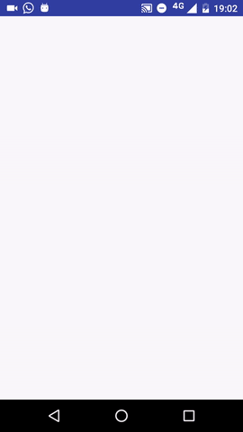

# Android MVP Architecture

MVP without RxJava or Dagger

Library reference resources:
------------------------------------
* [AppCompat, CardView, RecyclerView an DesignLibrary](http://developer.android.com/intl/es/tools/support-library/index.html)
* [Retrofit 2](https://square.github.io/retrofit/)
* [Butterknife](https://github.com/JakeWharton/butterknife)
* [Picasso](https://github.com/square/picasso)
* [CircleImageView](https://github.com/hdodenhof/CircleImageView)
